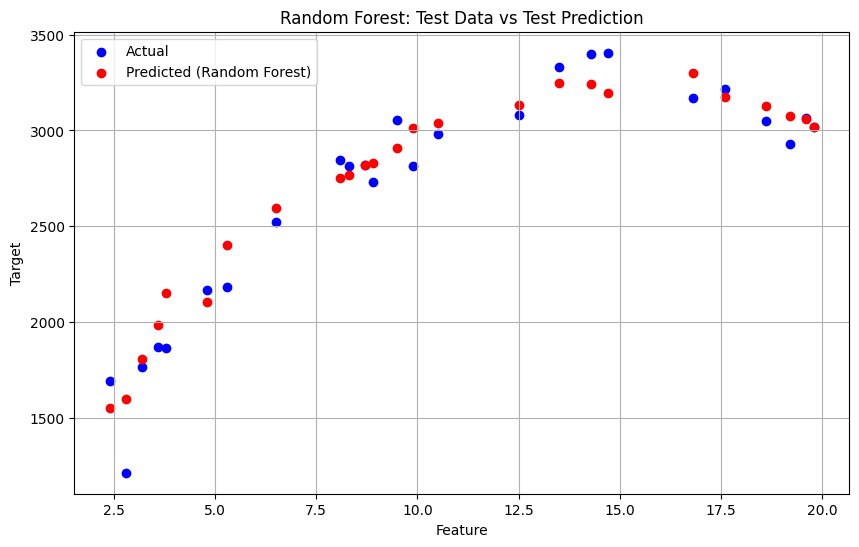

# Dibimbing-AILearning
This project is designed as a self-learning exercise to build a salary prediction model using supervised learning techniques. The goal is to predict salaries based on a dataset that includes years of experience and corresponding salary values. The project utilizes regression models such as Linear Regression, Decision Trees, and Random Forest Regression to create a model capable of estimating salary for a given number of years of experience. The implementation was done in Python and developed using Google Colab, making it easy to run and share.
## Machine Learning models - Supervised Learning
Supervised learning is a key method in AI where models learn from labeled data to make predictions. It works by training the model on examples with known inputs and outputs, helping it understand patterns in the data. In this project, supervised learning is used for regression tasks, predicting continuous values like salary based on features such as years of experience.

## Key Features
- Data Ingestion: Load and inspect the dataset using pandas.
- EDA: Visualize the relationship between experience and salary.
- Data Preparation: Handle duplicates, check missing values, and preprocess data.
- Modeling: Train and evaluate:
  - Linear Regression
  - Decision Trees
  - Random Forest Regression
- Evaluation: Compare models using metrics like MSE and R².
- Model Persistence: Save trained models for future use.

